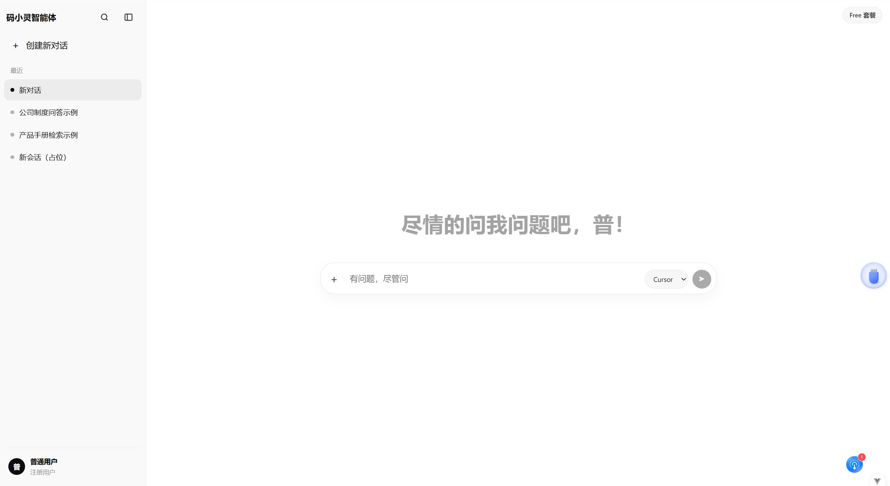

# 企业知识库智能问答

技术架构：LangChain4j + Spring Boot 3 + Elasticsearch + RabbitMQ + MySQL + Vue3 + MinIO

## 当前进度（Day1 ~ Day3）
前端聊天界面优化，仿企业级问答界面

### Day1 工程骨架与基础设施
- 后端多模块：`common` / `admin` / `rag` / `ingest` / `api`
- 统一响应体 `ApiResult`、全局异常、日志、Actuator
- Docker Compose 拉起 MySQL / RabbitMQ / Elasticsearch
- 自检接口：`GET /api/system/self-check`，健康检查：`GET /actuator/health`

### Day2 账号体系与后台登录
- 用户表 `sys_user`，角色 `ADMIN` / `USER`
- Spring Security + JWT（登录 / 刷新 / 退出 / me）
- 管理端接口统一前缀 `/api/admin/**`，未登录返回 401
- 默认站长：`admin` / `admin123`

### Day3 知识库 / 文档 / 配置 / 模型
- 表：`knowledge_base`、`kb_document`、`sys_config`、`llm_model`
- 文档上传至 MinIO，状态默认 `PENDING`
- 后台页面：知识库、文档、模型、系统设置（新增/编辑使用右侧抽屉）

---

## 目录结构

```
Project/
├── docker/docker-compose.yml
├── backend/
│   ├── pom.xml                 # 父工程
│   ├── common/                 # 公共：实体、JWT、统一响应
│   ├── admin/                  # 后台鉴权与管理 API
│   ├── rag/                    # RAG（后续）
│   ├── ingest/                 # 入库（后续）
│   └── api/                    # 启动模块
└── frontend/                   # Vue3 + Vite
```

---

## 启动步骤

### 1) 启动中间件

```bash
cd docker
docker compose up -d
```

### 2) 启动后端

```bash
cd backend
mvn -pl api -am spring-boot:run
```

### 3) 启动前端

```bash
cd frontend
npm install
npm run dev
```

访问：
- 用户聊天：http://localhost:5173/
- 站长登录：http://localhost:5173/admin/login

---

## Day2 验收示例

```bash
# 未登录应 401
curl -i http://localhost:8080/api/admin/dashboard/overview

# 登录拿 Token
curl -s http://localhost:8080/api/admin/auth/login ^
  -H "Content-Type: application/json" ^
  -d "{\"username\":\"admin\",\"password\":\"admin123\"}"

# 带 Token 访问管理接口
curl -s http://localhost:8080/api/admin/dashboard/overview ^
  -H "Authorization: Bearer <accessToken>"
```

---

## 后续计划（摘要）

- Day3：知识库与文档元数据
- Day4：RabbitMQ 异步入库
- Day5~6：解析切分与 ES 向量写入
- Day7~8：RAG 问答与检索增强
- Day9~11：聊天完善、SSE、后台运维
- Day12~14：稳定性、
- 
